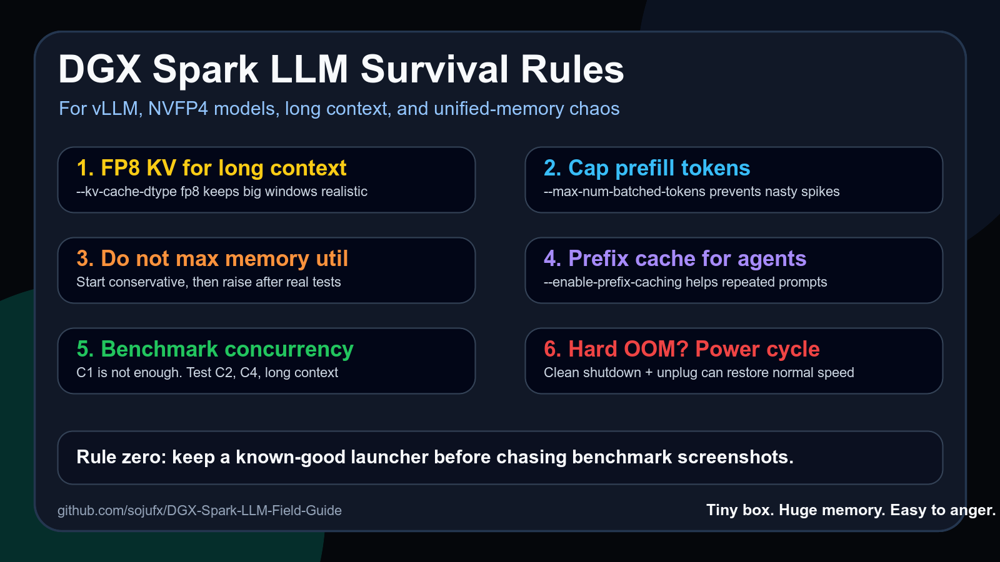

# DGX Spark LLM Field Guide

Practical notes, configs, and benchmarks from running local LLMs on a single NVIDIA DGX Spark / GB10.

> Tiny box. Huge memory. Very easy to anger.

## What this is

This repo is a field guide for people serving local models on DGX Spark with vLLM, NVFP4/FP8 models, long context, speculative decoding, and OpenAI-compatible agent workloads.

It is not an official leaderboard. It is a living notebook of things that worked, things that crashed, and configs that survived real use.

## Start here

- [DGX Spark survival guide](docs/SURVIVAL_GUIDE.md)
- [Safe vLLM configs](configs/VLLM_SAFE_CONFIGS.md)
- [Benchmark methodology](docs/BENCHMARK_METHOD.md)
- [Model scoreboard](docs/MODEL_SCOREBOARD.md)
- [Community results](COMMUNITY_RESULTS.md)
- [Blog-style survival guide](docs/DGX_SPARK_SURVIVAL_GUIDE.md)

## Published recipes

| Recipe | Best use | Context | Notes |
|---|---|---:|---|
| [DeepSeek V4 Flash One-Spark Stable Serve](https://github.com/sojufx/DeepSeek-V4-Flash-One-Spark-Stable-Serve) | huge MoE / DeepSeek at home | 128K | DS4 native server, memory admission guard, watchdog, OpenAI-compatible proxy |
| [Laguna S 2.1 DGX Spark Recipe](https://github.com/sojufx/Laguna-S-2.1-DGX-Spark-Recipe) | daily-driver long-context endpoint | 250K | stable memory profile, DFlash, prefix cache |
| [Qwen3.6 35B NVFP4 DGX Spark Recipe](https://github.com/sojufx/Qwen3.6-35B-NVFP4-DGX-Spark-Recipe) | fast coding / agent workload | 262K | native vLLM 0.26, FP8 KV, DFlash K=7 |

## Rules of thumb

1. Use FP8 KV for serious long-context serving.
2. Cap prefill with `--max-num-batched-tokens`.
3. Do not blindly max `--gpu-memory-utilization`.
4. Prefix caching matters for agents.
5. Speculative decoding is model-specific.
6. Benchmark real outputs, not 5-token screenshots.
7. After hard OOM behavior, clean shutdown and full power cycle can matter.

## Why this exists

DGX Spark is a strange and wonderful little machine. Its 128GB unified memory makes long-context local LLMs possible, but also means bad memory spikes can affect the whole box.

The goal here is simple: make Spark recipes reproducible instead of mystical.

## Contribute your results

Open an issue with:

- hardware
- model
- vLLM version
- context length
- KV dtype
- speculative decoding config
- C1/C2/C4 throughput
- long-context behavior
- crash/OOM notes

If enough people share results, this repo can become a practical map for single-Spark local inference.

## License

Apache-2.0.
